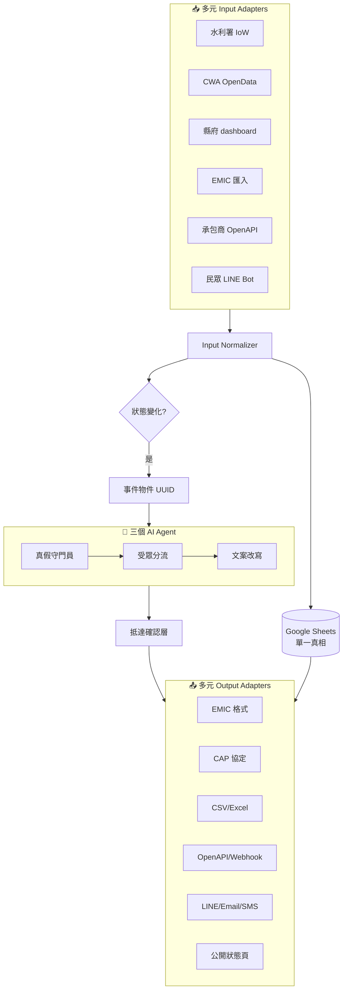

# 明管 Bright Pipe

> 不取代任何系統,只擔任訊號的橋樑。
> 從感測器到客廳,讓水情訊號真的抵達該抵達的人。

**Civic Tech Taiwan 2026 防災積木元件創新賽** 參賽作品
團隊:明管 Bright Pipe

## 📌 作品概念

明管 Bright Pipe 是**地方水情訊號與既有災防系統之間的橋樑元件**。

**核心命題:**「公部門最大的隱性危機,是『以為已經告訴民眾,但其實沒有』。」

馬太鞍溪堰塞湖事件揭露的不是技術問題,是**傳遞鏈的多層斷裂**:資料每 10 分鐘正確傳回,但狀態變化的關鍵時刻無法即時轉化為對應角色的可執行通知,且各既有系統(EMIC、縣府 dashboard、承包商系統)各自無法相容、紀錄不一致。

明管將每一筆狀態變化標準化為「**事件物件**」,作為跨單位的**單一真相來源**;透過 AI 三 Agent 完成真假判讀、受眾分流、文案改寫;以**抵達確認層**驗證訊息真的送達;以**多元格式介接層**(EMIC、CAP、CSV、OpenAPI)雙向匯出匯入,**不取代任何既有系統**。

---

## 🌊 使用情境

### 上游情境:應變中心值勤現場
某都市計畫區某監測站,18:42 從「半滿管」(綠)跳至「滿管」(黃),18:55 跳至「溢出路面」(紅)。

**現況:** 值班人員仰賴人工監看儀表板;民眾打 119、里長打電話、LINE 群組訊息混雜,沒有單一事件編號,跨單位紀錄不一致。

**有了明管:** 18:42 狀態變化瞬間,系統自動生成事件物件 UUID,推播給該里里長(LINE)、值勤人員(SMS)、鎮公所(Email),並追蹤誰真的收到。同一筆事件可一鍵匯出成 EMIC 格式回報災害應變中心。

### 下游情境:獨居長者
**核心 persona:** 一位住在低窪地區、不熟悉智慧型手機、習慣以鄰居口耳相傳取得資訊的獨居長者。她仰賴的判斷依據不是即時水位資料,而是「縣市首長有沒有宣布停班課」這個高度集中的人為決策訊號。在停班課公告與實際淹水之間若存在時間差,她正好落在資訊死角 —— 即使台灣已有 IoW 感測網、CWA 警特報、淹水感測器、雨量站等多層級資料源,**這些資料都沒辦法到達她**。

**有了明管(本期):** 訊號能更早離開資料源、進入結構化傳遞鏈,讓「該打電話給她的鄰居/里長/村幹事」更早收到通知。

**未來 Phase 2-3 將補上:** 台語語音層 + 替代接收裝置層(智能音箱、廣播、信標),讓警報直接抵達她已經習慣的物件 —— 收音機、客廳。

### 橫向情境:既有系統互通
- 消防署 EMIC 想接收地方創新的訊號 → 明管自動轉成 EMIC 格式
- 縣府既有 dashboard 想加入感測新源 → 明管 webhook 介接
- 沒有 IT 能力的鄉鎮公所 → 明管產出 CSV/Excel
- NPO 想自行部署 → 明管 GAS 全部開源

---

## 🔧 設計邏輯

### Input(多元輸入)

| 來源 | 格式 | 介接 |
|---|---|---|
| 水利署 IoW OpenData | JSON | REST API |
| CWA 警特報 | JSON | REST API |
| 縣府水位 dashboard | 自訂 | Webhook / 解析 |
| 消防署 EMIC | EMIC 標準 | CSV / API |
| 承包商系統 | 廠商自訂 | OpenAPI |
| 民眾通報 | 自然語言 | LINE Bot |

### Process(處理流程)

```
1. GAS Time Trigger 每 5 分鐘 + 多入口接收
2. Input Normalizer:統一轉為事件物件格式
3. detectStateChange():比對上次狀態 vs 這次
4. createEventObject():生成標準化事件 UUID
5. 寫入 Google Sheets(單一真相來源)
6. AI Agent 三步驟:真假守門員 → 受眾分流 → 文案改寫
7. 多通道推播 + 抵達確認層(未達自動升級)
8. 多元格式匯出
```

### Output(多元輸出)

| 輸出 | 用途 | 對接對象 |
|---|---|---|
| EMIC 標準格式 | 介接消防署主幹 | 縣府災害應變中心 |
| CAP 國際協定 | 介接 NPO/民間 | 國際防災組織 |
| CSV / Excel | 給無 IT 能力單位 | 鄉鎮公所、村里辦公室 |
| OpenAPI / JSON | 跨系統介接 | 承包商系統、開發者 |
| Webhook | 即時訂閱 | 其他訂閱系統 |
| LINE / Email / SMS | 終端推播 | 里長、值勤、長者 |
| 公開狀態頁 | 透明稽核 | 一般民眾、媒體 |

---

## 🤖 AI 使用說明

明管 Bright Pipe 包含三個 AI Agent,皆使用 Gemini API:

### Agent 1:真假警報守門員(多步驟判斷)
比對鄰近站當前數值 → 比對歷史同雨量條件水位 → 評估感測器穩定性 → 輸出 0–100 信心分數。

### Agent 2:受眾分流調度員(跨資料源 + 工具調用)
事件位置 + 對象屬性 + 時段條件 → 查通訊錄 → 選通道組合 → 觸發推播 → 等待確認。

### Agent 3:文案改寫員(分眾語意調整)
為里長版、長者版(口語、台語預留)、外語版(英、越、印、泰)、青壯年版生成適合訊息。原始警報保留於訊息底部。

### AI 治理設計
- **降溫不噤聲原則:** AI 只能調整推播強度,不能阻止規則層警報送出
- **規則層 override:** 警報核心邏輯由規則決定,AI 為輔助層
- **失敗回退:** 任一 Agent 失敗 → 自動降級為規則引擎,警報照常送出
- **個資隔離:** Agent 不接觸個人聯絡資料
- **完整稽核:** 所有判斷理由記錄至 Google Sheets,可逐筆檢視
- **透明性標註:** 每筆 AI 改寫訊息標註「本訊息由 AI 改寫,原始警報請見 [連結]」
- **可關閉性:** 三個 Agent 皆可獨立關閉,降級為純規則引擎運作

---

## 🏗️ 系統架構圖



---

## 🎯 核心戰略原則

> **「我不是來搶位置的,我是來搭橋的。」**

- ✅ **不取代任何既有系統**:EMIC、縣府 dashboard、廠商系統一律保留
- ✅ **多元相容**:支援雙向匯出匯入(EMIC、CAP、CSV、OpenAPI)
- ✅ **不限部署層級**:縣府、鄉鎮、NPO 皆可
- ✅ **降低採用阻力**:對方不需要改變自己的系統

這個原則直接降低 90% 的公部門採用阻力。

---

## 🪜 長期願景路徑(Phase 1–3)

```
              ↑ 中央主幹
              EMIC、CWA、水利署
                  │
              【橋樑層】← 本元件
                  │
        ┌─────────┼──────────┐
        │         │          │
     縣府系統   廠商系統    NPO 系統
        └─────────┼──────────┘
                  │
             Phase 1(本次):訊號層
                  │
             Phase 2(賽後):語意層
             台語/客語/在地語言 AI
                  │
             Phase 3(更遠):裝置層
             AirTag / 智能音箱 / 收音機
                  ↓
                 客廳
                 長者
```

### Phase 1(本次比賽):訊號層 + 介接層
事件物件標準化、AI 三 Agent、抵達確認、多元系統介接。

### Phase 2(賽後 6–12 個月):語意層
整合台語、客語、原住民語、東南亞語 AI 模型,將標準警報轉換為長者習慣的語言、語氣、節奏。

### Phase 3(更長期):裝置層
串接非智慧型手機接收裝置(藍芽信標、低功耗感測器、智能音箱、廣播頻段、村里廣播系統),讓警報抵達**長者本就熟悉的物件**。

**此計畫不限於公部門採用路徑;在公民科技與 NPO 協作模式下,亦可獨立推動。**

---

## 💡 預期效益

1. **縮短「資料 → 行動」時間差**:從仰賴人工監看降到 5 分鐘內自動觸發
2. **提供跨單位的單一真相來源**:解決紀錄不一致
3. **讓資訊死角中的長者真的收到訊息**:分眾 + 抵達確認
4. **既有系統可即時納入新訊號源**:不需改架構
5. **元件可被任何單位 fork 與部署**:縣府、鄉鎮、NPO 皆適用

---

## 🧩 元件可拼接性說明

明管 Bright Pipe 以積木式設計,內部模組均可獨立使用:

- **「事件物件標準化器」** — 可單獨作為其他防災工具的中介層
- **「多元 Input/Output Adapters」** — 可單獨作為跨系統格式轉換器
- **「AI 三 Agent」** — 可獨立關閉或單獨使用某一個
- **「抵達確認層」** — 可獨立應用於任何推播場景
- **「公開狀態頁」** — 可作為任何單位的災情透明儀表板

組合更強:整個元件作為「橋樑層」存在,讓地方創新與國家主幹兼容,並透過多元格式雙向流通,完整覆蓋從感測器到客廳的資訊鏈。

---

## 🛠️ 技術棧

- **Google Apps Script** — 主流程、Time Trigger、多源資料拉取
- **Google Sheets** — 事件記錄、抵達追蹤、單一真相來源
- **Gemini API** — 三個 AI Agent
- **HTML** — 設定介面、公開狀態頁
- **LINE Notify API** — 主要推播管道
- **Email / SMS Gateway** — 備援推播管道

---

## 📅 開發進度

- [x] 2026/05/05 — 提案構想完成
- [x] 2026/05/06 — 開設 GitHub repo
- [ ] 2026/05/15 — 設計文件完成、初步送件
- [ ] 2026/05/16–5/31 衝刺週(整合 + AI Agent + UI + Demo 影片)
- [ ] 2026/06/01 — MVP 完成、最終送件

---

## 📚 申請人實務背景

申請人具備跨層級、跨領域的防災實務經驗:

- **觀光遊樂區**:辦理颱風關閉觀光區公告,觀察到網路社群觸及有限,**不同年齡層需要不同推播管道**才能真正傳達。
- **偏鄉公所**:辦理災民收容演練,在資訊鏈下游親身觀察數位落差,**「發出訊息」不等於「傳達清楚」**。
- **水利相關單位**:進駐應變中心需接受多元資訊如水位即時監測資料,在資訊鏈上游目睹資料持續正確、但行動鏈卻斷裂的實況。

三段經驗讓本元件不是來自概念推演,而是來自第一線觀察。

---

## 📖 參考資料來源

- 水利署 IoW 平台:https://iot.wra.gov.tw/
- 即時水位 OpenData:https://data.gov.tw/dataset/25768
- 中央氣象署 OpenData:https://opendata.cwa.gov.tw/
- 馬太鞍溪堰塞湖事件相關公開報導(2025/9)

---

## 📜 開源授權

MIT License — 任何單位、任何個人皆可自由使用、修改、部署。

---

## 📮 聯絡

如對本元件有採用、合作、提問之意願,歡迎透過 GitHub Issues 聯繫。

---

*本文件為設計說明,程式碼將於 2026/05/26–06/01 衝刺期間陸續上傳。*
